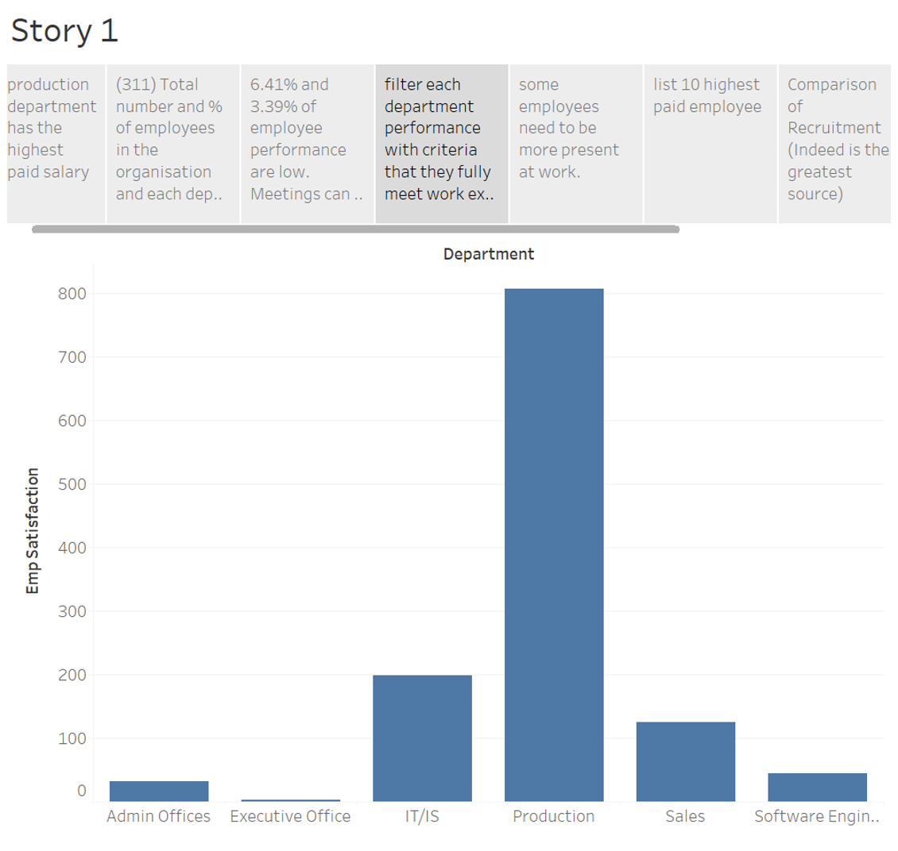

# DataAnalysis_Tableau
# Descriptive and Predictive Analysis for both Sales Data and Human Resource Dataset
# Data preparation with prep builder.

I have done analysis for sale data .

# DescriptiveAnalysis and PredictiveAnalysis for Human Resource Dataset
# I have done analysis for HumanResource data.

 
